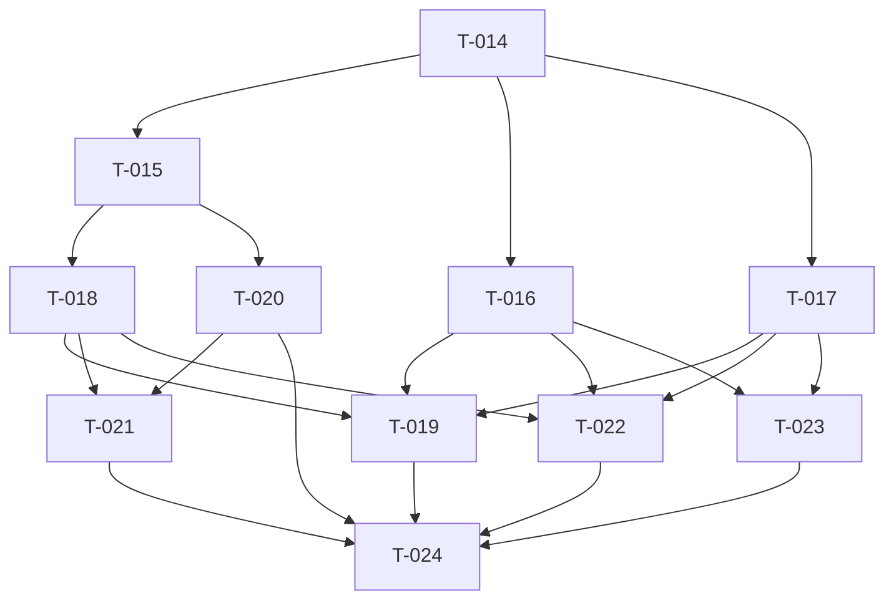

# 迭代 v2 依赖图

本文档展示本次迭代 Task Card 之间的依赖关系。

## 依赖图（Mermaid 格式）

## Epic 分组

| Epic | 任务 | 说明 |
|------|------|------|
| E-4（基础设施扩展） | T-014, T-015, T-016, T-017 | 类型扩展、Context 扩展、API 扩展、参数控件 |
| E-5（画布交互） | T-018, T-019, T-020, T-021, T-022, T-023, T-024 | 菜单、版本、连接、串联、Mask、Thinking、集成 |

## 并行执行分组

### 第 1 批（无依赖，可并行）
- T-014（类型定义）

### 第 2 批（T-014 完成后，可并行）
- T-015（CanvasContext 扩展）
- T-016（API 扩展）
- T-017（参数控件）

### 第 3 批（T-015, T-016, T-017 完成后，可并行）
- T-018（图片节点菜单）
- T-019（版本管理与重新生成）
- T-020（连接线）
- T-023（Thinking 展示）

### 第 4 批（T-018, T-020 完成后）
- T-021（串联 Prompt 构建）

### 第 5 批（T-018, T-022 完成后）
- T-022（Mask 抠图）

### 第 6 批（全部完成后）
- T-024（主页面集成）

## 文件统计

| 文件 | 被哪些 Task 修改 |
|------|-----------------|
| src/types/models.ts | T-014 |
| src/types/api.ts | T-014 |
| src/contexts/CanvasContext.tsx | T-015 |
| src/services/nanoBananaApi.ts | T-016 |
| src/components/Controls/ModelSelector.tsx | T-017 |
| src/components/Controls/ParamControls.tsx | T-017 |
| src/components/Controls/ImageSizeSelector.tsx | T-017 |
| src/components/Canvas/ImageNodeMenu.tsx | T-018, T-019 |
| src/components/Canvas/ImageAnnotationModal.tsx | T-018 |
| src/components/Canvas/index.ts | T-018 |
| src/components/Prompt/PromptInput.tsx | T-019, T-021, T-023 |
| src/components/Canvas/CanvasConnection.tsx | T-020 |
| src/components/Canvas/InfiniteCanvas.tsx | T-020 |
| src/components/Sketch/SketchOverlay.tsx | T-022 |
| src/components/Canvas/CanvasToolbar.tsx | T-022 |
| src/pages/MainPage.tsx | T-024 |
